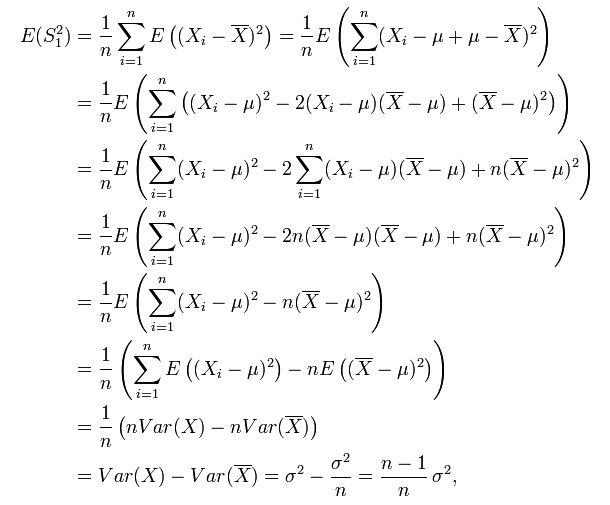

# WHY DOES THE SAMPLE VARIANCE HAVE N-1 IN THE DENOMINATOR?

## This website is good to explain this question:https://www.zhihu.com/question/20099757

if $S_1^2 = \frac{1}{n}\sum_{i=1}^n(X_i - \bar{X})^2$, but  

 
So, if you want to use non-bias estimator of variance, you need use this:
$$S^2 = \frac{1}{n-1}\sum_{i=1}^n(X_i - \bar{X})^2$$